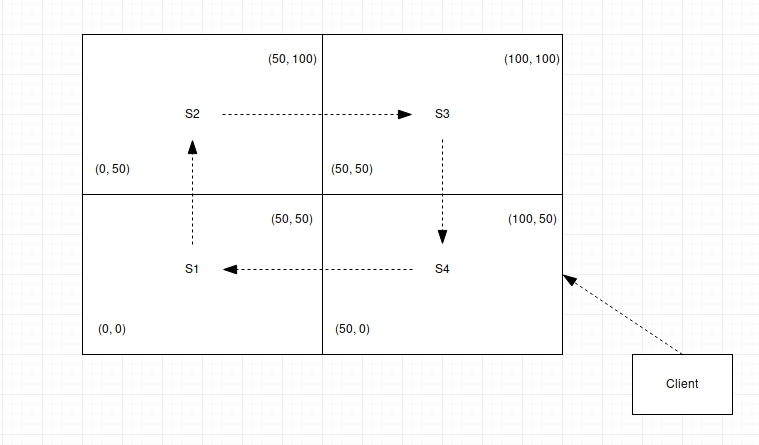
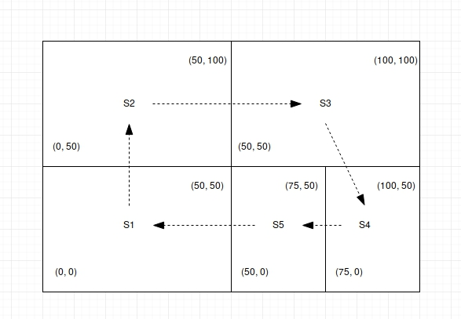
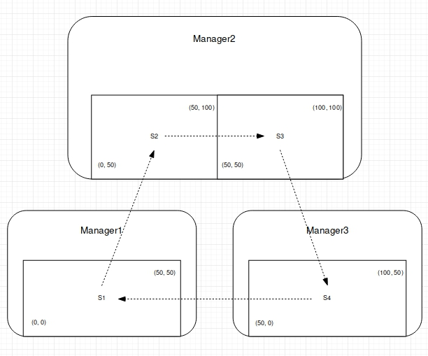

# Spacy-Tempy una Base de datos espacio-temporal distribuida

#### Propuesta: [Propuesta de trabajo final](Propuesta.md)

## Introducción

En este proyecto se decidió Implementar una base de datos espacio temporal, utilizando una tipo de datos abstracto propuesto por el paper ["I+3 R-Tree: un método de acceso espacio-temporal"](http://sedici.unlp.edu.ar/bitstream/handle/10915/21205/Documento_completo.pdf?sequence=1) llamado I3Rtree capaz de almacenar información espacial  de aquellos nodos que se van moviendo en el espacio-tiempo. Permitiendo así, resolver consultas sobre posición, trayectoria, estadía y puntos por donde se irán moviendo en una región determinada.
Además se incorporo los conceptos aprendidos en esta materia sobre manejo de información de manera distribuida entre diferentes nodos/computadoras, disminuyendo la carga total en cada uno de los servidores.

Se implemento a menor escalar la tarea de distribución de carga entre diferentes servidores como así la idea de agregar dinámicamente nuevas computadoras a la red del proyecto. Finalmente permitimos a nuestra red de servidores tener tolerancia a fallos, donde los servidores toleran  la baja de las diferentes computadoras dentro de la red distribuida.  

Entraremos en mas detalle sobre los conceptos tratados en este proyecto, contando los detalles de implementación a medida que avance el documento.

## I+3 R-Tree: un método de acceso espacio-temporal
Como se menciono anteriormente, la idea central de nuestro proyecto se basa en la propuesta de este paper, el cual desarrolla una nueva estructura de datos  llamada I+3 R-Tree.
I+3 R-Tree es una estructura de datos que surge de combinar un [Rtree](https://es.wikipedia.org/wiki/%C3%81rbol-R) de tres dimensiones (dimension x, dimension y e tiempo), una [LinkedList](https://en.wikipedia.org/wiki/Linked_list) y un [Map](https://jarroba.com/map-en-java-con-ejemplos/) capaces de almacenar la información  pasada y presente de todos aquellos nodos dentro de una región cualquiera a lo largo del tiempo.
A continuación se explicara brevemente porque es necesaria cada una de ellas y cuales son sus ventajas/desventajas.

### Rtree
El I+3 R-Tree utiliza un Rtree de 3 dimensiones para almacenar toda la información pasada de los nodos que se movieron dentro de un espacio físico e informacion adicional como, cuanto tiempo han permanecido en ese punto antes de moverse.

### LinkedList
El I+3 R-Tree utiliza una LinkedList, enlazando los últimos movimientos de todos los nodos. Es necesario mantener este invariante de representación para hacer de manera eficiente la resolución de consultas espacio-temporales.

### Map
El I+3 R-Tree utiliza un Map de longitud N (donde N es la cantidad de nodos moviéndose dentro de la región), el cual permite almacenar toda la información presente de los nodos en una región.

El paper continua explicando de manera detallada cual es la diferencia entre este [TAD](https://en.wikipedia.org/wiki/Abstract_data_type) y 2+3 R-Tree. Comenta que este ultimo solo puede resolver 2 tipos de consultas espacio-temporales y que, el I3Rtree puede resolver hasta 5 consultas.

Las consultas espacio temporal que permiten esta implementación son:

 * Identificar todos los nodos que están presentes en una región R en un instante de tiempo I.

 * Identificar todos los nodos de una región R en un intervalo de tiempo [ti; tk].

 * Identificar todos los nodos que pasaron por una región especifica R.

 * Mostrar el camino que realizo un nodo N.

 * Identificar la posición actual de un nodo N.

Si bien el paper explica como llevar a cabo estas consultas, no creemos necesario entrar en detalle sobre como se resuleven de manera eficiente la busqueda de informacion espacio-temporal. Aun asi, para observar el costo de las mismas se puede ver la siguiente cita, la cual compara su eficiencia con el anteriormente mencionado 2+3 R-Tree:

#### Consulta Timeslice:
Ambas estructuras se comportan en este caso de manera similar, siendo un poco mas alto  el  costo  de  consulta  en  el  2+3  R-Tree  debido  a los  accesos  a  disco  extras necesarios para obtener las posiciones actuales de los objetos.  

#### Consulta Intervalo
Resulta altamente similar a la eficiencia del 2+3  R-Tree.

#### Consulta Eventos
Es un subconjunto de Timeslice, el cual contiene solamente los objetos que ingresan o salen  de  la  región  de  consulta  en  el  instante de  tiempo  dado.  Por  esta  razón,  la evaluación  experimental  realizada  para  la  consulta de  Timeslice  es  valida  también para la consulta de tipo Eventos.

#### Consultas de Trayectoria
Para poder comparar el desempeño de la consulta de trayectoria se realizó un análisis de costo de búsqueda para las dos estructuras, tanto el I+3 R-Tree como para el 2+3R-Tree.  Este  análisis  de  costo  se  realizó  debido  a que  el  2+3  R-Tree  no  posee  un método para resolver la trayectoria.

#### Consulta Posicion Actual
Como el I+3 R-Tree utiliza un Map manteniendo el ultimo movimiento de cada nodo, el orden de la respuesta de esta consulta es el orden provisto por la busqueda del Map.

### Implementación del I+3 R-Tree
Nuestra implementación del I+3 R-Tree, consiste en una tupla de 3 elementos {3DRtree, Map, LinkedList}, la cual en conjunto almacena la información espacio-temporal de todos los nodos dentro de una región limitada. Un I+3 R-Tree en principio no tiene limites de espacio para manejar información espacial. Además permite a una entidad, subscribir se, desubscribirse del I+3 R-Tree y así mantener solo la información pasada de este. Permite resolver los cinco tipos de consultas espacio-temporal propuestos anteriormente manteniendo todos los invariantes de representación necesarios para que estas sean eficientes como dice el paper.

El principal problema que tuvo nuestro grupo de trabajo fue el encontrarse sin ningún apoyo de implementación por parte del paper, por lo cual recurrimos a la minuciosa lectura de los invariantes de representación y propiedades de la estructura de datos para diseñar una implementación propia. A pesar de esto, pudimos encontrar una implementación de Rtree publica en erlang que finalmente utilizamos para simplificar notablemente el tiempo dedicado a representar el I+3 R-Tree.

Como tarea bonus, se implemento la opción de partir un I+3 R-Tree en dos subárboles, cada quien con su región inicio y región final,  pero finalmente descartado para su utilización en el proyecto.

Nuevamente, no vale la pena entrar en detalles de implementación en este documento ya que si bien esta parte es muy necesaria, no es la mas interesante para resaltar en este informe.

## Servidor secuencial utilizando I+3 R-Tree
Una vez implementada la base de datos dimensional y definida su interfaz, se decidió implementar un servidor secuencial capaz de utilizar la misma para proveer respuestas a clientes en tiempo real. Este servidor fue la primer versión que vio el proyecto, capaz de atender request de subscripción, desubscripcion y movimiento de  nodos a través del tiempo. También, capaz de respoder las cinco consultas espacio-temporal de manera concurrente.

En principio, como el servidor es secuencial decidimos que solo tenga un I+3 R-Tree el cual contenga toda la información de todos los nodos, sin limite de espacio. Esta misma se ira actualizando a medida que el server vaya respondiendo sus request a aquellas entidades  subscritas. Una vez que el nodo deja de estar subscrito, aunque este envié request de movimiento al servidor, el servidor no hará que su I+3 R-Tree handlee el pedido.

Como el objetivo de esta implementación era la de realizar una pequeña prueba de uso dinámico del I+3 R-Tree (la cual fue muy satisfactoria), fue claramente descartada para dar paso a su versión mejorada, un servidor completamente distribuido.

## Servidor distribuido utilizando I+3 R-Tree
Luego de implementar una primera versión del servidor utilizando un I+3 R-Tree, descubrimos algunas limitaciones y propiedades que debíamos tener en cuenta para esta nueva versión. Además, buscamos simplificar notablemente la interfaz provista por el server hacia sus clientes, permitiendo solo hacer request de movimiento y consultas entre el/los servidores y la entidad en movimiento. Como el objetivo del proyecto es de crear una base de datos distribuida generalizable, decimos abstraernos totalmente de algún dominio de uso especifico.

Vimos que el mejor camino a simplificar la tarea de capturar request de entidades en movimiento dentro de una región era la de mantener no solo un servidor, sino poder tener muchos capaces de resolver los pedidos del cliente. Esta misma idea, nos genero varias preguntas interesantes como ¿ Cuantos servidores tener ? ¿ Como dividir los servidores ? ¿ Quien se encarga de responderle al cliente ? entre muchas otras. Optamos por diseñar los servidores de tal manera que trabajen en conjunto, independientemente de la cantidad de ellos. Algo interesante de mencionar, que se hará referencia cuando se explique la arquitectura de los mismos, es la de, no solo mantener distribución continua entre los servidores, sino también concurrencia en las tareas mas complejas.

Analizando un poco  uso central el proyecto, pensamos algunas alternativas para respoder las preguntas mencionadas y llegamos a la conclusión en que, por un lado, los servidores deben poder manejarse de manera transparente a la cantidad total de pares que tengan, por otro lado, nos encontramos en el dilema de como dividir la responsabilidad de cada servidor. Una de ellas es la que, un servidor se encargara de un conjunto finito de clientes, reduciendo altamente la carga de otros servidores. La otra opción es la que, un servidor se encargara de recibir request de todos los clientes que se estén moviendo en una región especifica y así, distribuir en mayor medida la carga entre todos servidores, ya que cada servidor se ocupara de una única región física.

### Arquitectura distribuida
Una vez definidos los principales problemas a atacar, diseñamos una arquitectura especifica para el manejo de los servidores distribuidos.

Decimos utilizar una arquitectura de anillo entre los servidores para delegar la responsabilidad de estos a la hora de procesar un request de un cliente, por ejemplo, si se movió de un servidor a otro (lo cual es transparente para el cliente), donde esto genera una desubscripcion de uno de los servers y una subscripción en otro.
Otra ventaja que provee esta arquitectura es que no importa a que servidor se este haciendo la consulta, si el servidor al que le llega el request se da cuenta que no debe encargarse de tal pedido, este delegara a su siguiente la responsabilidad y continuara trabajando.

Entonces, un servidor sera un proceso que puede estar corriendo, tanto en el mismo nodo local que sus pares como en diferentes, registrándose con un nombre único. Este servidor en principio tendrá un rango mínimo y máximo ({Xmin, Ymin}, {Xmax, Ymax}) del cual se encarga de procesar request de los clientes y además, conocer el rango rango físico máximo que es capaz de responder la red de servidores. Una vez creado este servidor esperara a que le notifiquen que servidores serán sus pares a la hora de procesar requests espacio-temporales y el servidor siguiente al mismo, como mencionamos anteriormente estaremos utilizando una arquitectura de anillo para simplificar notablemente el handleo de request entre servidores. Para concretar la idea, un servidor distribuido se encargara de procesar requests de una región física limitada, conocera a sus pares y además, conocera a su siguiente, entonces, cada uno de los servidores (que pueden estar corriendo en diferentes computadoras) tendrá un  I+3 R-Tree almacenando la información de esa región.

Es necesario que cada servidor conozca a cada uno de sus pares por varios motivos, uno de ellos es que, como ahora cada servidor se encargara de almacenar la información espacial de un rango limitado, para resolver las consultas espacio-temporales se requiere de la respuesta de los otros servidores, veamos un ejemplo de esto. Si un cliente hace una consulta pidiendo saber cual fue su recorrido desde un instante Ti a otro Tk, vemos que un solo servidor ahora, no es suficiente para responderle a tal cliente ya que solo conoce parte de la respuesta. Vemos tambien que es necesario almacenar la respuesta de todos sus servidores pares, ordenarlas y enviarle la respuesta final a cliente. Este es el punto mas interesante para aplicar la concurrencia en nuestro proyecto, sabemos que realizar una consulta, puede ser costosa en términos de tiempo y que además, no puede lockear temporalmente a los servidores, por lo tanto para realizar el procesamiento de consultas espacio-temporales utilizamos concurrencia todo el tiempo. Para que esto quede claro, en la siguiente sección mostraremos un ejemplo visual y se explicara mas detalladamente.

Otro motivo por el cual es necesario que cada uno de los servidores conozca a todos sus pares es que, para realizar algunas tareas que requieren consenso (que se detallaran mas adelante) como por ejemplo el balanceo de carga, control de fallos, entre otros.

Vale aclarar que, hacer que todos los servidores se conozcan entre si, abre un abanico de posibilidades para crear nueva funcionalidad que necesite gran distribución de carga.

### Manejo de Consultas distribuidas
Anteriormente contamos que  nuestros servidores pueden responder 5 tipos de consultas espacio-temporales. TimeLapse, consulta encargada de de encontrar todos los nodos presentes en una región en un instante único I, de Intervalo capaz de encontrar todos los nodos presentes en una región dentro de un intervalo de tiempo , de Trayectoria capaz de encontrar el camino realizado por un nodo en desde un tiempo i hasta un tiempo k , de  Evento capaz de encontrar todos aquellos nodos que pasaron por una región física R y Posición actual capaz de saber donde esta actualmente un nodo. Como dijimos, ahora que nuestros servidores solo se encargan de procesar información de un fragmento del mapa total encontramos varios problemas, a continuación contaremos cuales de estas consultas generaron inconvenientes y como se solucionaron.

Para un mejor entendimiento supongamos que tenemos cuatro servidores cada uno encargado de una region fisica, identico al ejemplo de la seccion anterior.

#### TimeLapse
Como bien sabemos, un cliente puede realizar una consulta o un request de movimiento a cualquier server dentro de la red de servidores, en este caso, vemos que la mayor dificultad con respecto a nuestra arquitectura es la de buscar al servidor responsable de realiar la consulta.

#### Intervalo
En este caso, es un ejemplo bastante similar al anteriormente descripto, por lo tanto no provee un nivel de dificultad mayor al mismo.

#### Trayectoria
Quizá el mas interesante a contar, esta query realmente necesita de la respuesta de cada uno de los servidores por los que paso un nodo a lo largo del tiempo, además, no solo es necesario combinar la respuestas de los diferentes servers, sino que esta respuesta final debe estar ordenada a través del tiempo.

#### Evento
Una región definida en una query puede necesitar que mas de un server deba contestarle al cliente, por lo tanto, estos se comunican y combinan sus respuestas para finalmente enviársela al interesado.

#### Posición actual
Sin mas complejidad que las dos primeras, se sabe que un nodo no puede estar en dos servidores y menos en dos espacios físicos al mismo tiempo. Por lo cual solo es necesario encontrar al servidor responsable y este se encargara de comunicarle la respuesta al cliente.

Vale recordar que como estos request no necesitan estar totalmente sincronizados se utilizo la concurrencia para lanzar nuevos procesos encargados de procesar y consensuar las respuestas. Además, es interesante destacar que, dependiendo que decisiones tomes en el diseño de la arquitectura simplifica o complejiza notablemente las tareas a resolver.

### Balanceo automatico de carga local
Para hacer mas inteligentes a nuestros servidores decidimos implementar la idea de balanceo automatico de carga. En principio esta idea no es nada trivial y existen muchos metodos para llevarlo a cabo, aun así explicaremos brevemente como resolvimos los problemas y como se llevo a cabo.

Previo a la implementación nos hicimos varias preguntas frente a esta problemática, como por ejemplo, ¿ Como sabemos cuando balancear ? ¿ Hacemos alguna cuenta dinámica ? ¿ Consensuamos entre los diferentes servidores para balancear ? ¿ Permitimos que todos balanceen o solo el de mayor carga ? entre muchas otras, aun así optamos por algunas respuestas un poco simplificadas, decidimos darle a cada uno de los servers una carga máxima que puede soportar y que esta carga se ira restando hasta llegar a 0. Cuando un servidor llega a su limite de carga les exige a cada uno de sus pares que vuelva a contar desde el inicio y este mismo genera una partición de su región. Es sencillo entender porque se implemento así, solo el servidor con mas carga hasta el momento sera aquel capaz de particionarse.

Como cada servidor tiene un rango mínimo y un rango máximo el cual utiliza para saber cuales request debe resolver y cuales no, particionar un servidor se vuelve sencillo, creamos un nuevo server encargado de gestionar la mitad exacta de la región del servidor inicial y este ultimo actualiza su nueva región. De todas formas, no es tan trivial la implementación, recordar que cada servidor debe conocer a todos sus pares y a su siguiente, por lo tanto es necesario mantener estos invariantes una vez particionados. Ya que ahora, el nuevo server debe conocer a su siguiente que puede ser el servidor inicial o aquel que apuntaba este ultimo. Finalmente una vez creado el nuevo server este envía un aviso a cada uno de los servidores de la red, notifiandoles que existe un nuevo servidor par.

Si bien esta implementación es factible y funciona correctamente en nuestra red de servidores, nada garantiza que dos servidores no puedan particionarse al mismo tiempo antes que llegue el aviso de reconteo. Por lo tanto, en este punto es necesario un algoritmo de exclusión mutua para garantizar que solo un servidor pueda balancearse. Notar que si dos servidores se particionan al mismo tiempo, alguno de los invariantes de la arquitectura podrían perderse.

### Adicion de nuevos servidores "On the fly"
Previamente contamos que los servidores podrían estar corriendo en una misma computadora o en diferentes, por lo tanto es de gran interés para el proyecto permitir crear nuevos servidores "On the fly" para balancear la carga total de la red  existente. Para llevar a cabo esto decidimos que este nuevo servidor se comunique con cada uno de los actualmente corriendo, pidiendoles su carga total. Una vez obtenida la carga total de cada uno de los servidores, elige al servidor con la mayor carga y le exige que se particione, una vez particionado este server le brinda al nuevo una mitad del servidor y este finalmente entrando a la red de servidores como un par.

Como en el titulo anterior se hizo mención del funcionamiento del balanceo de carga, no vimos de interés entrar mas en detalle.

## Managers
Anteriormente hicimos referencia sobre la manera en que funcionan nuestros servidores, contamos que cada uno de ellos puede estar trabajando en computadoras diferentes donde, se irán comunicando mediante su nombre de proceso registrado delengandose la tarea de responder un request. Pero esto mismo nos llevo a hacernos algunas preguntas como ¿ Si se quiere agregar una nueva computadora a la red de Servers que se necesita hacer ? ¿ Como sabemos cuantos servers corren en un mismo nodo ? ¿ Que sucede si una computadora deja de función ? . Como se puede ver podríamos tener muchos servidores en diferentes nodos y estas preguntas generan ciertas problemáticas a resolver dentro de este contexto. Por lo tanto, decidimos implementar la idea de Manager, un modulo capaz de lanzar procesos encargados de gestionar todos los servidores dentro de un nodo. Ya sea para reasignar nuevos servidores, para poner en funcionamiento nuevos nodos, para tolerancia a fallos o balanceo de carga entre computadoras.

### Arquitectura
Por lo tanto, ahora el Mánager sera nuestra representación del funcionamiento de nuestro nodo. El mánager conocera a cada uno de sus servidores (los que están corriendo en su computadora) y en caso de ser necesario este se comunicara con ellos para recurrir a información. Sin embargo para todos los servidores, la existencia de este mánager es transparente. Ya que los request de los clientes se seguirán haciendo hacia los servidores, independientemente de donde estén, el funcionamiento del mánager no afectara de ninguna manera a estos últimos. Entonces, ahora los mánager también se conocerán entre si e irán comunicando se para manejar asuntos que exceden al comportamiento de los servers.

### Adicion de nuevos managers "On the fly"
Cada mánager ahora, estará corriendo en computadoras distintas en conjunto con sus servers y el trabajo se esta haciendo de manera distribuida entre todos los nodos. ¿ Pero que sucede si queremos agregar un nuevo nodo a nuestra red ? ya sea porque podemos costear una nueva computadora o simplemente porque vimos la necesidad de redistribuir la carga de mensajes entre mas computadoras. Aprovechando el balanceo de carga local que se da de manera automática entre los servidores y el balanceo manual. Vimos que era posible una vez se crea un nuevo nodo avisarles a cada uno de los managers en la red que consensúen la llegada de un nuevo par. Cuando estos managers son notificados, les envían un mensaje a cada uno de sus servidores, consultandoles su carga. Acto seguido cada mánager le envía a un encargado (un proceso aparte) la carga total que posee en ese momento, este encargado verificara que mánager es el de mayor carga y le avisara que debe brindarle el servidor mas pesado al nuevo par. Cuando el mánager es notificado, verifica que la cantidad de servers que posee sea mayor a uno, en este caso le brinda el estado del server con mayor carga al nuevo nodo para que este comience su funcionamiento. En caso contrario, si el mánager solo posee un servidor, le dirá a este ultimo que se balancee y finalmente le brindara una de sus mitades al nuevo mánager.

### Control de fallos

Para la realizacion de control de fallos recurrimos a pensar varias posbilidades basadas en nuestra arquitectura, ya sea de managers como de servers. Como ahora, el estado util de un nodo, lo maneja el manager, entendimos que era de gran valor realizar la tolerancia a fallos desde este nivel del proyecto.

Las preguntas disparadoras para pensar en diferentes opciones fueron las siguientes:

##### ¿ Quien se encarga de monitorizar a quien ?
Tal vez la pregunta mas interesante con respecto a este tema ya que define básicamente el camino a seguir para restablecer servidores caídos en nuestra red. En principio pensamos que podríamos hacer una versión de "master slave" donde existe un mánager master encargado de monitorizar a todos sus pares pero con la diferencia de que cada uno de los managers podría tener una prioridad donde, en caso de que el master caiga alguien pueda reemplazarlo y seguir monitorizando al resto. Por otro lado pensamos que podría ser útil que cada uno de los managers monitoree a todos sus pares pero si bien esta opción es muy consistente con respecto a la recuperación de datos es cierto que también requiere que cada uno de los managers le envié todo el estado de sus servidores a cada uno de ellos, por lo tanto nos pareció un poco bastante costoso aunque claramente depende de la importancia de los datos.

Finalmente Optamos por un camino similar al de la arquitectura de los servidores, donde cada manager monitorea a uno solo de sus pares (no hace falta tener orden). Esta decisión nos permite no tener tanta carga de datos en el envió de información y nos da una cierta consistencia en la recuperación de los servidores. Por lo tanto, cada uno de los managers se entera si su par falla y se va de la red.

##### ¿ Bajo que concepto notificamos un nuevo estado ?
Sin menor importancia y de gran problemática esta claro que si el objetivo del control de fallos es el de recuperar información a pesar de que los nodos se caigan, es necesario saber cada cuanto tiempo, o cada que cierto evento notificaremos que el estado de un nodo cambio. En principio vemos que es totalmente ineficiente tener el 100 % del estado actualizado con su master, ya que enviar todo el estado es realmente costoso podríamos decir que el evento que determine si debe actualizarse debería ser dinámico y calculado con respecto a la cantidad de cambios sucedimos. Por lo que creímos mejor determinar un tiempo fijo en segundos al cual un mánager estará esperando para notificar su nuevo estado, sin embargo este mánager sabiendo que esta acción es costosa deberá revisar si los cambios que sucedieron en sus servidores son suficientes como para que realmente valga la pena actualizarlos con su master. Por falta de tiempo en nuestro proyecto nos vimos en la necesidad de simplificar notablemente esta idea y recurrimos a solo la primer parte, donde los managers cada cierto tiempo notificaran su nuevo estado aunque los servidores no hallan sufrido cambios.

##### ¿ Que hacer cuando hay una baja ?
Una vez definido quien sera el responsable de monitorizar a cada uno de los managers dentro de una red y definido cada que cierto tiempo o evento estos actualizaran su estado queda por definir que sucede una vez nos llega el aviso de que un manager ha fallado. Supongamos que tenemos una red de 3 computadoras, similar al ejemplo mostrado en la arquitectura, donde manager1 monitoriza a manager2, manager2 monitoriza a manager3 y finalmente manager3 monitoriza a manager1. Además supongamos que manager2 sufre un corte electrico y este inmediatamente se desconecta de la red perdiendo así todos sus datos. frente a este problema nuestra implementación realizara lo siguiente, en principio manager1 se entera que esto ha sucedido y dejara de monitorear a manager2 para monitorizar a manager3 el cual lo obtendrá del estado enviado por manager2. Luego manager1 comienza a recrear los servidores cada uno con su estado del programa de la ultima actualización realizada y finalmente le actualizara su estado a aquel que lo esta monitorizando, para así, en caso de que manager1 sufra una caída, su par ya tendrá la copia de los nuevos servidores.

## Pruebas

### Bench

### Limites

### Estadisticas Locales vs Distribuida

## Trabajo Futuro

Como todos los proyectos, quedan propuestas sin implementar y este no escapa de ellas, podemos decir que quedaron algunas ideas que no pudimos concretar en el lapso de tiempo dado para el trabajo. Pero iremos contando por arriba cuales fueron y cual es su orden de complejidad.

### Mejor control de fallos

Como mencionamos un poco en la sección anterior, el control de fallos fue implementado con éxito pero a costo de simplificar un poco el funcionamiento. Podríamos decir que seria de gran utilidad una mejora en el calculo para actualizar los nuevos estados de los servidores, donde usariamos una proporción promedio y compararla iteración por iteración en función de la carga total de los servidores. Otra mejora posible es la de la cantidad de información que posee el estado total de un mánager, un estado podría ser la diferencia con el estado anterior, por lo tanto el costo de actualización se reduciría notablemente. Además, podríamos buscar alguna forma de replicar mas información sin tanto costo y carga entre los mismos managers.

### Algoritmos de exclusión mutua para decidir quien participan un server

Cuando explicamos el balanceo automatico local de los servidores distribuidos contamos que estos usan un numero máximo de request como contador para saber cuando deben balancearse. Bien dijimos que nada garantizaba que dos servidores lleguen al mismo tiempo e intenten entre si, resetear el contador del otro, por lo tanto existe una posibilidad de que la red de servidores quede de-sincronizada entre los diferentes servers y existen servidores que nadie conozco, por lo tanto servidores que pueden perderse en el control de fallos. Este problema, es fácilmente solucionable, solo es necesario implementar un algoritmo de exclusión mutua en el balanceo automatico. El mejor algoritmo que creemos útil implementar en este problema es de anillo ya que proveemos una arquitectura similar a la planteada por el mismo algoritmo.

## Conclusion

### Transparencia para el usuario
