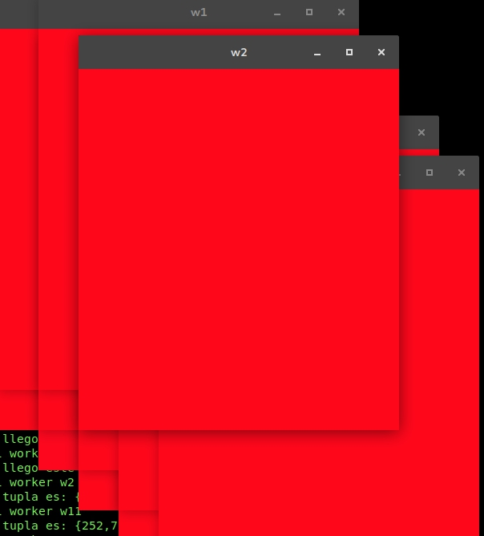

# TP7 Toty: multicast con orden total

### 2.3. Experimento

#### 1. Analizar que pasa si tenemos un sistema que se basa en una entrega con orden total pero esto no fue claramente establecido. ¿Si la congestión es baja y no tenemos retrasos en la red, cuanto tiempo tarda antes de que los mensajes se entreguen fuera de orden?
Como ejemplo en el libro vemos que el efecto de pérdida de mensajes y la inconsistencia de ordenamiento puede depender del método de replicación y la importancia de que todas las réplicas estén actualizadas.
El ancho de banda consumido, es proporcional al número de mensajes enviados en cada operación de entrada y salida.

Entonces podemos decir que entre más mensajes se estén enviando los Workers, el Cast incrementará su capacidad para almacenar y distribuir los datos a cada uno. El tiempo ha estimar también dependerá del tiempo que tiene cada Worker en el envío de sus mensajes, entre más corto el tiempo, el Cast se congestionará de mensajes y este podría enviar mensajes fuera de orden.

#### 2. ¿Cuán difícil es hacer debug del sistema y darnos cuenta que es lo que está mal?
Para verificar el correcto funcionamiento del multicast básico, lo que hicimos fue incrementar el número de Workers en las pruebas establecidas y así poder ver si los mensajes se entregan en tiempo y orden para cada uno de ellos.

Al tratarse de un sistema multicast donde, todos los nodos de una red, envían mensajes y al mismo tiempo escuchan, es difícil encontrar la fuente de un error si el sistema falla. Esto se debe a que es difícil de distinguir que worker es el que envió un mensaje que puede o no llegar de manera incorrecta.

En un principio para encontrar y validar los problemas de nuestro test, utilizamos una pequeña cantidad de Workers, esto simplificó notablemente la búsqueda de un fallo. Además, decidimos imprimir por pantalla la identidad de cada worker cuando este actualizaba su vista, permitiéndonos seguir de manera secuencial los diferentes sucesos.

Finalmente, aprovechamos el Sleep y Jitter para comprobar el completo funcionamiento. Ya que estos afectan de manera significativa la performance del sistema, vimos que eligiendo un Sleep y Jitter muy pequeño la probabilidad de desincronización era muy alta.

### 4. Experimentos

#### 1. Probar usando el multicaster de orden total. ¿Mantiene los workers sincronizados?
Habiendo implementado el algoritmo ISIS propuesto por el trabajo, vemos que los Workers se mantienen sincronizados y hay integridad en los envíos de mensajes, es decir, que los mensajes se mantienen en orden en que se hace la petición para el multicast, estos se van liberando uno a uno para cada uno de los Workers.

Probando nuestro nuevo test, donde se utiliza multicasting de orden total y usando en el mismo un Sleep/Jitter muy pequeños con una cantidad considerable de Workers, notamos que la sincronización entre estos últimos es muy alta, al punto en que cada ventana que perteneciente a un Worker distinto muestra el color en común. A pesar de esta gran sincronización, existe una posibilidad, tal vez, por algún error en algún indice de nuestro código en que un solo mensaje llega fuera de orden, por lo que una pantalla muestra levemente una diferencia de color con respecto al resto. Como dijimos esta posibilidad es muy pequeña, donde podemos afirmar que sucede una vez por cada 10000 mensajes aproximádamente.

Para finalizar con nuestras pruebas, concluimos que el tiempo que tardan los multicastings (cada uno asignado a su Worker) para consensuar el número de secuencia de un mensaje es realmente insignificante. Por lo tanto, apreciamos que la tarea de consenso entre Multicasting y la de notificar que un mensaje puede ser enviado sucede realmente muy rápido.

#### 2. Tenemos muchos mensajes en el sistema, ¿Cuantos mensajes podemos hacer multicast por segundo y como depende esto del número de workers?

En principio, para poder saber con precisión que cantidad de mensajes se envían por segundo, es necesario crear un test un tanto más robusto y consistente. A falta de este test, basamos nuestra respuesta en la experiencia obtenida luego de haber corrido nuestras muchas pruebas anteriormente. Habiendo dicho esto, podemos decir que la cantidad de mensajes por segundo es realmente muy grande y que este número no es notablemente limitado por la cantidad de Workers. Además, cada Worker envía su mensaje a su propio Multicasting y este inmediatamente le pide a sus pares una propuesta. Como el consenso se hace de manera distribuida, ningún Multicasting tiene sobrecarga de datos y permite recibir otro envío de mensaje de su Worker sin retraso.

Aun así, si cada Worker tiene asignado un único Multicasting, por lo tanto, la realización del consenso será de orden N, donde N es la cantidad de Multicasting que deben ponerse de acuerdo, es decir, la cantidad de Workers. Esto nos indica que, si existe un leve crecimiento de tiempo en el consenso si la cantidad de Workers es mayor.

#### 3. Construir una red distribuida, ¿cuán grande puede ser antes de que empiece a fallar?
Hay varios aspectos a considerar para que una red distribuida llegue a tener fallas, por ejemplo que falle en un proceso, la ejecución arroja un resultado incorrecto, esto puede ser por un bloqueo de procesos o un interbloqueo, tiempo expirado.
Los sistemas distribuidos tienen una gran ventaja sobre los sistemas centralizados y es porque son tolerantes a fallos. No quiere decir que nunca vaya a fallar pero que una tarea falle o en nuestro caso un worker no reciba su mensaje o no envié eso no evita que los demás workers puedan seguir funcionando correctamente.

Una red distribuida tiene capacidad de crecimiento incremental, es decir se puede añadir más procesamiento al sistema incrementando su pontencia en forma gradual según las necesidades. Entonces puede ser tan grande como sea necesario, claramente es necesario que el sistema funcione correctamente, es decir que las fallas no sean por lógica o implementación, sino que puede fallar por pérdida de mensajes, saturación en tráfico, etc.

### *Nota
Las respuesta escritas en este informe fueron verificadas con el capítulo del libro correspondiente al trabajo (DISTRIBUTED SYSTEMS
Concepts and Design Fifth Edition - 4.4 Multicast communication).